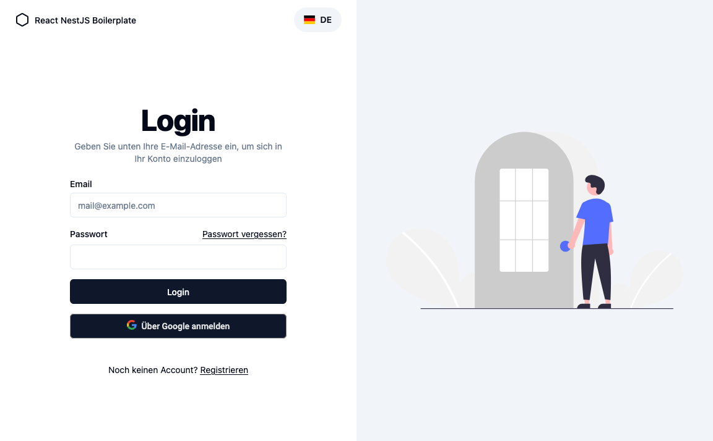

# React Nest.js Auth darts

> [!IMPORTANT]
> This Readme is a work in progress and will be updated over time.

The darts project aims to provide a solid production-ready foundation for building your own projects so that you can focus on building features instead of setting up the basic infrastructure. You can try out the live demo [here](https://darts.jschad.de/).



## Features

- **Authentication**: Register, login, and logout with JWT.
- **Responsive Design**: Works on devices of all sizes.
- **Turborepo**: Uses a Monorepo setup powered by Turborepo and pnpm workspaces.
- **Complete Signup Flow**: Register with email, verify email, and login.
    - **Email Verification**: Verify email addresses with a unique token.
    - **Forgot Password**: Reset passwords with a unique token.
    - **Google OAuth**: Login with Google.
- **User Management**: View and edit profile details.
    - **Upload Profile Picture**: Upload and crop profile pictures.
- **Store Files**: Upload and download files.
    - **S3 Storage**: Store files on S3-compatible storage.
    - **Local Storage**: Alternatively store files on the local filesystem.
- **Deployment**: Docker and docker-compose files for easy deployment.
- **Internationalization**: Serve your application in different languages.
- **Diagnostic Tools**: Optional support for monitoring and debugging.
    - **Sentry**: Monitor and fix crashes in real-time.
    - **Plausible**: Track user interactions without compromising privacy.
    - **Logging**: Log errors and other important events to the console or remote logging services.

## Getting Started

Fork this repository and start coding your application. Please read this Documentation to understand how the darts works and how you can customize it to your needs.

## Development

To get started with the development server, you first need to copy the `.env.template` file to `.env` and set the required environment variables.

```bash
cp .env.template .env
```

Then install the dependencies and start the development server.

```bash
pnpm install
```

```bash
pnpm dev
```

## IDE Settings

If you are using a VSCode based IDE, you should add the following settings to your IDE settings to ensure ESLint is working correctly.

```json
{
    "eslint.workingDirectories": [
        {
            "mode": "auto"
        }
    ]
}
```

## Imprint

The data displayed on the imprint page is loaded from the following environment variables. In addition this data is also included all emails sent by the application.

- `IMPRINT_CONTACT_1`
- `IMPRINT_CONTACT_2`
- `IMPRINT_CONTACT_3`
- `IMPRINT_CONTACT_4`
- `IMPRINT_COPYRIGHT`

## Privacy Policy

This application includes a dedicated endpoint to serve the privacy policy in different languages based on the user's request. This ensures compliance with data protection regulations like GDPR while offering a localized experience for users. The privacy policy itself is not included and must be provided separately.

### Initial Setup

The data protection policy files live in the `apps/server/dist/src/assets/privacy-policy/files` directory. On startup tries to read files of supported languages. Supported languages are defined in the `prisma.schema` file in the Language enum. For example, if `Language.DE` is defined you should have a `de.md` file in the `server/src/assets/privacy-policy/files` directory. By default the application will serve the `en.md` version if the requested language could not be loaded.

### During Development

- Place your `.md` files in the `apps/server/dist/src/assets/privacy-policy/files` directory.
    - Example: `de.md` for German, `en.md` for English.
    - Note: The filenames should be in lowercase and match the language codes.

### During Deployment

You have 2 options to make deployment work including the privacy policy files.

1. **Option 1**: Remove the `server/src/assets/privacy-policy/files/.gitignore` file and add the privacy policy files to your repository. This is the easiest way to add the privacy policy files to your deployment.
2. **Option 2**: Mount a volume containing the privacy policy files to the `/app/server/src/assets/privacy-policy/files` directory. This way you can add the privacy policy files to your deployment without adding them to your repository. Add this to your `docker-compose.yml` file:

```
volumes:
    - ./directory/to/your/privacy/policy:/app/server/assets/privacy-policy/files:ro
```

## Logging

This application uses [Winston](https://github.com/winstonjs/winston) for logging. The logging can be configured to put logs to the console or to a remote logging service like [SigNoz](https://signoz.io/). If `LOGGING_OTEL_URL` is set, the application will put logs to the remote logging service. You can add `LOGGING_OTEL_HEADERS` if you need to add additional headers to the logs. Currently the remote logging service is only tested with a on premises SigNoz instance. If you need different logging behavior, you can implement your own solution by editing the `src/util/logging/otel.transport.ts` file.
